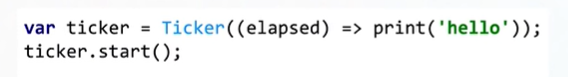

# animation_deep_dive
此簡單的範例會在一秒鐘內，將畫面上顯示的值，從 1 一直顯示到光速的值 299792458

* 註 : 此範例是為了更深入了解動畫原理的練習，因此未遵從 Flutter 內隱式 / 顯式動畫的規則，建議不要這樣用

### 影片大部分逐字稿之重點紀錄

Ticker 是一個 object 會每幀呼叫內部的 function，若忘了使用 ticker.dispose 消滅他，其將會一直執行，直到 App 結束為止。

因此 Flutter 提供了 SingleTickerProviderStateMixin，這樣就不用自行管理 ticker。

在已經 extend state 中的 class mixin 他之後，你的 state 就變成了一個 ticker provider。

這代表著 Flutter framework 可以向其索取 ticker，換句話說，就是 animation controller 可以向其索取 ticker。

AnimationController 需要 ticker 才能夠運行，如果使用 SingleTickerProviderStateMixin，
在 Animation Controller 的 vsync 建構子中，填入 "this" 就可以了。

AnimationController 常用來 : 撥放、反轉、停止動畫。與純粹的 tick 事件相比，
其能夠在任何時間，告訴我們動畫目前處於何處。像是到 50%、99% 或是完成了。

通常我們利用 AnimationController 以及或許加上 curve 或是經由 tween 轉換他並用在動畫相關 widget 中。

在此為了學習，我們不這樣做。而是直接呼叫 setState。

我們在初始化 Animation Controller 後，我們可以加入一個 listener，並在此 listener 中呼叫 setState。

我們用在 build 裡要變動的整數值，他會根據目前 Controller 的值，在 listener 中改變他的值，
並且setState，因此畫面上的值就會改變。