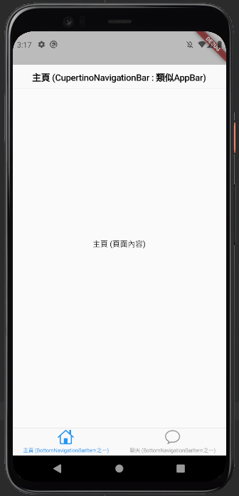

# cupertino_widgets

此次主要在練習 Cupertino 風格的 widgets 

### 結果樣式預覽


### CupertinoTabScaffold 用法簡述
```dart= 
// Tab Bar 外必用的 scaffold
CupertinoTabScaffold(

  // BottomNavigationBarItem 的 List
  tabBar : tabBar,

  //用以回傳對應 index 的頁面
  tabBuilder : tabBuilder,  
)
```

### CupertinoPageScaffold 用法簡述
```dart=
//頁面的scaffold
CupertinoPageScaffold(
    navigationBar: CupertinoNavigationBar(),  // 上面那條，似 AppBar
    child: child,
);
```

