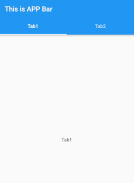

# tab_bar
preview : 


參考教學 : 
[TabBar 選項卡頁面導航元件](http://tw-hkt.blogspot.com/2019/08/flutter-tabbar.html)

### 說明
TabBar 需要以下幾個核心組件
* Controller (簡單的可用DefaultTabController)
    * 用來控制葉面切換等
    * DefaultTabController的使用是包在 **APPBar 的建構函數外**的
* TabBar
    * 代表的是畫面實際上的 widget
    * 其為AppBar下的額外參數設定
    * AppBar(``AppBar其他參數``, **bottom: TabBar(tabs: ``Tab 文字or組合 的List``)**,
* Tab
    * 為TabBar中，各個Tab所顯示的 **文字** or 組合，整體為List形式
* TabBarView 
    * 各Tab對應的頁面內容
    * 需要是 List <widget> 的形式
    
### 程式架構
大致如下 : 
```dart=
DefaultTabController(  // Controller
    length: myTabs.length, 
    child: Scaffold(
      appBar: AppBar(  
        title: Text("AppBar文字"),
        bottom: TabBar(  //AppBar 下呼叫 TabBar 建構子
          tabs: myTabs,  //每個 Tab 的文字 List
        ),
      ),
      body: TabBarView(  //每個 Tab 對應的頁面內容
        children: <Widget>[HomePage(), ChatPage(), AccountPage()],
      ),
    ),
  ),
```